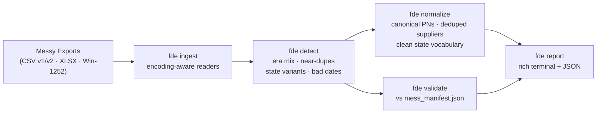

# fde-data-forge

[](https://github.com/RedBeret/fde-data-forge/actions/workflows/ci.yml)
[](LICENSE)
[](https://www.python.org/)

> **All data is synthetic.** Meridian Fabrication Co. is a fictional company created for integration demonstrations.

**Fabrication Data Engineering Forge** — a Python CLI tool for ingesting, detecting defects in, and normalizing messy manufacturing data exports. Companion to [acme-parts-cloud](https://github.com/RedBeret/acme-parts-cloud), which generates the source data.

The tool handles the full detection-to-normalization pipeline: encoding-aware CSV/XLSX ingestion, fuzzy supplier deduplication, part number era classification, state vocabulary normalization, and validation against a ground-truth manifest.

<p align="center"></p>

---

## Architecture



---

## Quick Start

```bash
pip install -r requirements.txt -e .

# Run the bundled synthetic sample report
make sample-report

# Detect defects in a parts file
fde detect parts_v1.csv --type parts-v1

# Detect supplier near-duplicates and invalid emails
fde detect suppliers.csv --type suppliers

# Normalize part numbers to canonical form
fde normalize parts_v1.csv --type parts-v1 --out clean_parts.csv

# Full pipeline with manifest validation
fde report \
  --parts parts_v1.csv \
  --suppliers suppliers.csv \
  --change-orders change_orders.xlsx \
  --manifest mess_manifest.json \
  --out report.json
```

**Windows:** run `run.bat` to install and verify.

The `samples/` directory includes small exports copied from `acme-parts-cloud` (300 parts, 60 suppliers, 300 change orders), plus the matching ground-truth manifest. No account, tenant, API key, or running Acme service is needed for the sample report.

### Results on the bundled sample

Output of `make sample-report` against the committed sample — rerun it yourself to reproduce:

| Category | Expected | Detected | Rate |
|---|---:|---:|---:|
| part_number_non_standard | 75 | 75 | 100% |
| supplier_near_duplicates | 24 | 18 | 75% |
| invalid_emails | 6 | 8 | 100%* |
| state_vocabulary_variants | 24 | 24 | 100% |
| impossible_dates | 11 | 11 | 100% |
| **overall** | **140** | **136** | **97.1%** |

Two honest wrinkles worth knowing about. The near-duplicate detector misses supplier variants that differ by more than casing and punctuation (fuzzy threshold trades recall for precision — see QUIRKS.md). And the email validator is stricter than the seeder, so it flags two extra addresses the manifest doesn't count; the rate is capped at 100%.

---

## CLI Reference

| Command | Description |
|---------|-------------|
| `fde detect SOURCE --type TYPE` | Detect defects in a single file. Types: `parts-v1`, `parts-v2`, `suppliers`, `change-orders` |
| `fde normalize SOURCE --type TYPE --out OUT` | Normalize a file to canonical form and write to OUT |
| `fde validate MANIFEST [--parts] [--suppliers] [--change-orders]` | Validate detection rate against `mess_manifest.json` |
| `fde report [--parts] [--suppliers] [--change-orders] [--manifest] [--out]` | Full pipeline report across all provided files |

The sample command writes `reports/sample_report.json`, which is ignored by git.

All commands accept `--out PATH` to write a JSON report alongside the rich terminal output.

---

## What Gets Detected

| Defect | Check |
|--------|-------|
| Part numbers in 3 naming eras (`PN-NNNN`, `2019-PN-N`, `P{N}`) | Era classification + count |
| Non-standard or unknown part number formats | Regex match |
| Near-duplicate supplier names (`Vortex Metals` / `VORTEX METALS Inc.`) | Fuzzy matching (rapidfuzz, 85% threshold) |
| Malformed contact emails (missing `@`, `.invalid` suffix) | Heuristic |
| State vocabulary variants (`OPEN`, `In-Work`, `APPROVED`) | Variant map lookup |
| Impossible dates (`closed_at` < `opened_at`) | Timestamp comparison |

See [QUIRKS.md](QUIRKS.md) for the full defect catalog and normalization rules.

---

## Case Study

A data engineer running a synthetic ERP migration starts with exports from acme-parts-cloud: one old parts CSV, one current parts CSV, a legacy supplier export, and a change-order workbook with a merged header row. The first pass is deliberately mechanical: read every row, classify the known defects, normalize only the fields with documented rules, then compare the detected counts against `mess_manifest.json`.

That last step is the point of the project. It turns a cleanup script into a measured pipeline: which defect classes were found, which were missed, and whether a "fix" accidentally hid rows instead of repairing them.

---

## Works With

This tool is designed to process exports from [acme-parts-cloud](https://github.com/RedBeret/acme-parts-cloud). The bundled `samples/` directory is enough for a quick local run; full-size exports work the same way.

---

## Contributing

See [CONTRIBUTING.md](CONTRIBUTING.md).

## License

MIT — see [LICENSE](LICENSE).
