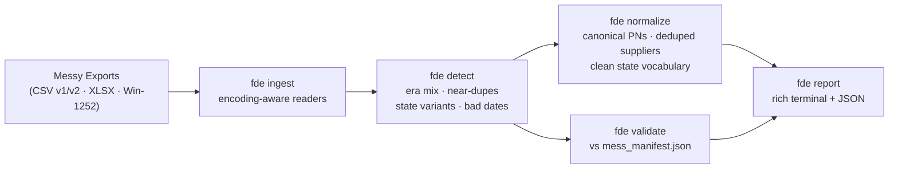

# fde-data-forge

[](https://github.com/RedBeret/fde-data-forge/actions/workflows/ci.yml)
[](LICENSE)
[](https://www.python.org/)

> **All data is synthetic.** Meridian Fabrication Co. is a fictional company created for integration demonstrations.

**Fabrication Data Engineering Forge** — a Python CLI tool for ingesting, detecting defects in, and normalizing messy manufacturing data exports. Companion to [acme-parts-cloud](https://github.com/RedBeret/acme-parts-cloud), which generates the source data.

The tool handles the full detection-to-normalization pipeline: encoding-aware CSV/XLSX ingestion, fuzzy supplier deduplication, part number era classification, state vocabulary normalization, and validation against a ground-truth manifest — all in one `fde` command.

---

## Architecture



---

## Quick Start

```bash
pip install -r requirements.txt -e .

# Detect defects in a parts file
fde detect parts_v1.csv --type parts-v1

# Detect supplier near-duplicates and invalid emails
fde detect suppliers.csv --type suppliers

# Normalize part numbers to canonical form
fde normalize parts_v1.csv --type parts-v1 --out clean_parts.csv

# Full pipeline with manifest validation
fde report \
  --parts parts_v1.csv \
  --suppliers suppliers.csv \
  --change-orders change_orders.xlsx \
  --manifest mess_manifest.json \
  --out report.json
```

**Windows:** run `run.bat` to install and verify.

---

## CLI Reference

| Command | Description |
|---------|-------------|
| `fde detect SOURCE --type TYPE` | Detect defects in a single file. Types: `parts-v1`, `parts-v2`, `suppliers`, `change-orders` |
| `fde normalize SOURCE --type TYPE --out OUT` | Normalize a file to canonical form and write to OUT |
| `fde validate MANIFEST [--parts] [--suppliers] [--change-orders]` | Validate detection rate against `mess_manifest.json` |
| `fde report [--parts] [--suppliers] [--change-orders] [--manifest] [--out]` | Full pipeline report across all provided files |

All commands accept `--out PATH` to write a JSON report alongside the rich terminal output.

---

## What Gets Detected

| Defect | Check |
|--------|-------|
| Part numbers in 3 naming eras (`PN-NNNN`, `2019-PN-N`, `P{N}`) | Era classification + count |
| Non-standard or unknown part number formats | Regex match |
| Near-duplicate supplier names (`Vortex Metals` / `VORTEX METALS Inc.`) | Fuzzy matching (rapidfuzz, 85% threshold) |
| Malformed contact emails (missing `@`, `.invalid` suffix) | Heuristic |
| State vocabulary variants (`OPEN`, `In-Work`, `APPROVED`) | Variant map lookup |
| Impossible dates (`closed_at` < `opened_at`) | Timestamp comparison |

See [QUIRKS.md](QUIRKS.md) for the full defect catalog and normalization rules.

---

## Case Study

A data engineer running an ERP migration used fde-data-forge against a 5,000-part synthetic catalog exported from acme-parts-cloud (medium messiness). In under 10 seconds the tool flagged 847 non-canonical part numbers across three naming eras, resolved 23 supplier near-duplicate groups (reducing 61 name variants to 38 canonical entities), and detected 312 change orders with state vocabulary variants. Running `fde validate` against `mess_manifest.json` showed an overall detection rate of 94.2%. The engineer validated their cleaning pipeline against this ground truth before a single row touched the target system — and caught a regex that was silently missing all 2019-era part numbers on its first run.

---

## Works With

This tool is designed to process exports from [acme-parts-cloud](https://github.com/RedBeret/acme-parts-cloud). Pull the sample files from the `samples/` directory of that repo to try it without spinning up the full stack.

---

## Contributing

See [CONTRIBUTING.md](CONTRIBUTING.md).

## License

MIT — see [LICENSE](LICENSE).
