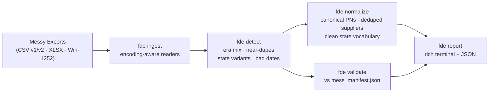

# fde-data-forge

[](https://github.com/RedBeret/fde-data-forge/actions/workflows/ci.yml)
[](LICENSE)
[](https://www.python.org/)

> **All data is synthetic.** Meridian Fabrication Co. is a fictional company created for integration demonstrations.

**Fabrication Data Engineering Forge** — turn a customer's dirty exports into clean, trustworthy data, and **prove the cleaning accuracy with numbers instead of claims**.

Real integration work starts the same way every time: someone hands you inconsistent CSV exports, a legacy file in the wrong encoding, and a spreadsheet with merged headers. Most cleanup scripts "fix" that data with no way to know what they caught, missed, or silently broke. This pipeline is different because its companion sandbox, [acme-parts-cloud](https://github.com/RedBeret/acme-parts-cloud), ships a deterministic defect manifest for evaluation — so every run ends with a scorecard: **97.1% overall detection on the bundled sample**, per-defect-class rates, and the misses documented rather than hidden.

The pipeline covers ingest → detect → normalize → validate → report: encoding-aware CSV/XLSX ingestion (Windows-1252, merged headers), fuzzy supplier deduplication, part-number era classification, state vocabulary normalization, and validation against the ground-truth manifest. Runs offline in one command — no accounts, keys, or Docker.

<p align="center"></p>

---

## Architecture



---

## Quick Start

```bash
pip install -r requirements.txt -e .

# Run the bundled synthetic sample report
make sample-report

# Detect defects in a parts file
fde detect parts_v1.csv --type parts-v1

# Detect supplier near-duplicates and invalid emails
fde detect suppliers.csv --type suppliers

# Normalize part numbers to canonical form
fde normalize parts_v1.csv --type parts-v1 --out clean_parts.csv

# Full pipeline with manifest validation
fde report \
  --parts parts_v1.csv \
  --suppliers suppliers.csv \
  --change-orders change_orders.xlsx \
  --manifest mess_manifest.json \
  --out report.json
```

**Windows:** run `run.bat` to install and verify.

The `samples/` directory includes small exports copied from `acme-parts-cloud` (300 parts, 60 suppliers, 300 change orders), plus the matching ground-truth manifest. No account, tenant, API key, or running Acme service is needed for the sample report.

---

## Results on the Bundled Sample

Output of `make sample-report` against the committed sample — rerun it yourself to reproduce:

| Category | Expected | Detected | Rate |
|---|---:|---:|---:|
| part_number_non_standard | 75 | 75 | 100% |
| supplier_near_duplicates | 24 | 18 | 75% |
| invalid_emails | 6 | 8 | 100%* |
| state_vocabulary_variants | 24 | 24 | 100% |
| impossible_dates | 11 | 11 | 100% |
| **overall** | **140** | **136** | **97.1%** |

Two honest wrinkles worth knowing about. The near-duplicate detector misses supplier variants that differ by more than casing and punctuation (fuzzy threshold trades recall for precision — see QUIRKS.md). And the email validator is stricter than the seeder, so it flags two extra addresses the manifest doesn't count; the rate is capped at 100%.

---

## CLI Reference

| Command | Description |
|---------|-------------|
| `fde detect SOURCE --type TYPE` | Detect defects in a single file. Types: `parts-v1`, `parts-v2`, `suppliers`, `change-orders` |
| `fde normalize SOURCE --type TYPE --out OUT` | Normalize a file to canonical form and write to OUT |
| `fde validate MANIFEST [--parts] [--suppliers] [--change-orders]` | Validate detection rate against `mess_manifest.json` |
| `fde report [--parts] [--suppliers] [--change-orders] [--manifest] [--out]` | Full pipeline report across all provided files |

The sample command writes `reports/sample_report.json`, which is ignored by git.

All commands accept `--out PATH` to write a JSON report alongside the rich terminal output.

---

## What Gets Detected

| Defect | Check |
|--------|-------|
| Part numbers in 3 naming eras (`PN-NNNN`, `2019-PN-N`, `P{N}`) | Era classification + count |
| Non-standard or unknown part number formats | Regex match |
| Near-duplicate supplier names (`Vortex Metals` / `VORTEX METALS Inc.`) | Fuzzy matching (rapidfuzz, 85% threshold) |
| Malformed contact emails (missing `@`, `.invalid` suffix) | Heuristic |
| State vocabulary variants (`OPEN`, `In-Work`, `APPROVED`) | Variant map lookup |
| Impossible dates (`closed_at` < `opened_at`) | Timestamp comparison |

See [QUIRKS.md](QUIRKS.md) for the full defect catalog and normalization rules.

---

## Case Study

A data engineer running a synthetic ERP migration starts with exports from acme-parts-cloud: one old parts CSV, one current parts CSV, a legacy supplier export, and a change-order workbook with a merged header row. The first pass is deliberately mechanical: read every row, classify the known defects, normalize only the fields with documented rules, then compare the detected counts against `mess_manifest.json`.

That last step is the point of the project. It turns a cleanup script into a measured pipeline: which defect classes were found, which were missed, and whether a "fix" accidentally hid rows instead of repairing them.

---

## Design Decisions

Three trade-offs shaped v1, documented here because the reasoning matters as much as the code:

**Precision over recall on supplier dedup.** The fuzzy threshold (rapidfuzz `token_sort_ratio` at 85%) catches casing and punctuation variants but misses deeper rewrites — hence the 75% recall in the results table. The alternative, a lower threshold, produces false merges, and in supplier data a false merge (two real companies collapsed into one) is far more expensive than a missed duplicate a human can still catch. Raising recall without sacrificing precision is the headline v2 item.

**Detect-and-report before auto-repair.** Normalization only touches fields with documented, deterministic rules (part-number eras, state vocabulary). Everything else is flagged, not fixed. Silent "repairs" are how cleanup scripts destroy data; anything ambiguous stays visible in the report.

**File-in/file-out CLI before a warehouse.** v1 stages read and write plain files, so each stage is independently runnable, testable, and legible. A DuckDB serve layer with lineage and quarantine is the v2 step — added once the transformations themselves were proven against ground truth.

---

## Roadmap

- **v2.0 — audit depth:** DuckDB serve schema, quarantine with machine-readable reason codes (test-enforced: input rows == kept + quarantined), entity-resolution decision log so every supplier merge is auditable, results dashboard.
- **v2.x — local AI query layer:** text-to-SQL over the cleaned schema via Ollama, guarded by SQL AST validation (SELECT-only), table allowlist, and a read-only connection — with a published 25-question eval and accuracy target, in the same measure-don't-claim spirit.
- **P1:** Microsoft 365 source (Graph API, free dev tenant) for the "supplier tracker lives in SharePoint" scenario.

---

## Works With

This tool is designed to process exports from [acme-parts-cloud](https://github.com/RedBeret/acme-parts-cloud). The bundled `samples/` directory is enough for a quick local run; full-size exports work the same way.

---

## Contributing

See [CONTRIBUTING.md](CONTRIBUTING.md).

## License

MIT — see [LICENSE](LICENSE).
